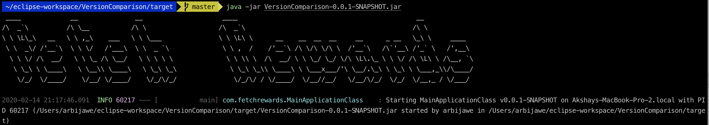

## FetchRewards Version Compare

### Prerequisites
+ Maven (v3.5.2)
+ Java (v1.8)

Note: The project is tested with the above specified versions. It may or may not work with different versions. 

### Building the project
+ Simply run: `mvn package` to build the project and it will create the target directory. 
+ Once built, navigate to the target directory and run the following command: `java -jar VersionComparison-0.0.1-SNAPSHOT.jar` and spring application will start as follows:

